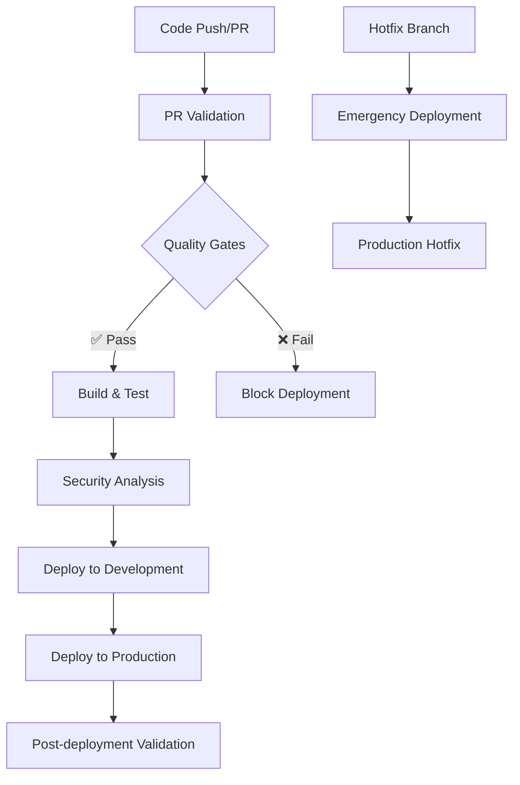

# 🚀 TailspinToys CI/CD Pipeline Documentation

This repository contains a comprehensive CI/CD pipeline built with GitHub Actions for the TailspinToys .NET 9 application. The pipeline implements industry best practices for security, quality, and deployment automation.

## 📋 Pipeline Overview

### 🎯 Core Features

- ✅ **Multi-environment deployment** (Development → Production)
- 🔒 **Security-first approach** with CodeQL and dependency scanning
- 🧪 **Comprehensive testing** (unit, integration, performance)
- 📦 **Reusable components** with composite actions and workflows
- 🌐 **Azure deployment** using OIDC authentication
- 🚨 **Emergency hotfix workflows** for critical issues
- 🔄 **Automated dependency management** with Dependabot

### 🏗️ Workflow Architecture



## 📁 Repository Structure

```
.github/
├── actions/                    # 🔧 Reusable composite actions
│   ├── build-dotnet/          # .NET build, test, and publish
│   └── deploy-azure/          # Azure deployment with OIDC
├── workflows/                 # 🔄 GitHub Actions workflows
│   ├── ci.yml                # Main CI/CD pipeline
│   ├── pr-validation.yml     # Pull request validation
│   ├── hotfix-deployment.yml # Emergency deployments
│   └── reusable-deployment.yml # Reusable deployment workflow
├── config/                   # ⚙️ Configuration files
│   └── environments.yml      # Environment-specific settings
├── codeql/                   # 🔒 Security analysis configuration
│   └── codeql-config.yml
└── dependabot.yml           # 🤖 Automated dependency updates
```

## 🔄 Available Workflows

### 1. 🏠 Main CI/CD Pipeline (`ci.yml`)

**Triggers:**
- Push to `main`/`develop` branches
- Pull requests to `main`/`develop`
- Manual workflow dispatch

**Jobs:**
1. **🏗️ Build & Test** - Builds application and runs tests
2. **🛡️ Security Analysis** - CodeQL and dependency scanning  
3. **✅ Quality Gate** - Validates all checks pass
4. **🚀 Deploy to Development** - Deploys to dev environment
5. **🌐 Deploy to Production** - Deploys to production (main branch only)
6. **📊 Post-deployment** - Validation and reporting

### 2. 🔍 Pull Request Validation (`pr-validation.yml`)

**Triggers:**
- Pull request events (open, update, review)

**Features:**
- Multi-OS build matrix (Linux, Windows, macOS)
- Extended test suites (unit, integration, performance)
- Security analysis with CodeQL
- Documentation validation
- Comprehensive PR status reporting

### 3. 🚨 Hotfix Deployment (`hotfix-deployment.yml`)

**Triggers:**
- Releases with 'hotfix' prefix
- Push to `hotfix/*` branches  
- Manual emergency dispatch

**Features:**
- Fast-track deployment with minimal gates
- Emergency mode option (bypasses some checks)
- Extended verification and rollback planning
- Audit trail for compliance

### 4. 🔄 Reusable Deployment (`reusable-deployment.yml`)

A reusable workflow that other repositories or workflows can call:

```yaml
jobs:
  deploy:
    uses: ./.github/workflows/reusable-deployment.yml
    with:
      environment: 'development'
      app-name: 'my-webapp'
      dotnet-version: '9.0.x'
    secrets:
      azure-client-id: ${{ secrets.AZURE_CLIENT_ID }}
      azure-tenant-id: ${{ secrets.AZURE_TENANT_ID }}
      azure-subscription-id: ${{ secrets.AZURE_SUBSCRIPTION_ID }}
```

## 🔧 Composite Actions

### 🏗️ Build .NET (`build-dotnet`)

Reusable action for building, testing, and publishing .NET applications.

**Features:**
- .NET SDK setup with caching
- Configurable build/test options
- Code coverage collection
- Artifact publishing
- Cross-platform support

**Usage:**
```yaml
- uses: ./.github/actions/build-dotnet
  with:
    dotnet-version: '9.0.x'
    configuration: 'Release'
    run-tests: true
    collect-coverage: true
    publish-app: true
```

### 🚀 Deploy Azure (`deploy-azure`)

Reusable action for deploying applications to Azure Web Apps.

**Features:**
- OIDC authentication with Azure
- Deployment verification
- Health checks
- Comprehensive logging
- Rollback capabilities

**Usage:**
```yaml
- uses: ./.github/actions/deploy-azure
  with:
    app-name: 'my-webapp'
    package-path: './publish'
    azure-client-id: ${{ secrets.AZURE_CLIENT_ID }}
    azure-tenant-id: ${{ secrets.AZURE_TENANT_ID }}
    azure-subscription-id: ${{ secrets.AZURE_SUBSCRIPTION_ID }}
```

## ⚙️ Configuration

### 🔐 Required Secrets

Configure these secrets in your repository settings:

| Secret | Description | Example |
|--------|-------------|---------|
| `AZURE_CLIENT_ID` | Azure Service Principal Client ID | `12345678-1234-1234-1234-123456789012` |
| `AZURE_TENANT_ID` | Azure Active Directory Tenant ID | `87654321-4321-4321-4321-210987654321` |
| `AZURE_SUBSCRIPTION_ID` | Azure Subscription ID | `abcdef01-2345-6789-abcd-ef0123456789` |

### 📊 Required Variables

Configure these variables in your repository settings:

| Variable | Description | Example |
|----------|-------------|---------|
| `AZURE_WEBAPP_NAME_DEV` | Development Azure Web App name | `tailspintoys-dev` |
| `AZURE_WEBAPP_NAME_PROD` | Production Azure Web App name | `tailspintoys-prod` |

### 🌍 Environment Configuration

Environment-specific settings are defined in `.github/config/environments.yml`:

- **Development**: Full logging, debugging enabled
- **Staging**: Production-like with some debug features
- **Production**: Minimal logging, all optimizations enabled

## 🔒 Security Features

### 🛡️ GitHub Advanced Security

- **CodeQL Analysis**: Semantic code analysis for security vulnerabilities
- **Dependency Scanning**: Automated vulnerability detection in dependencies
- **Secret Scanning**: Prevents accidental secret commits
- **Security Advisories**: Automated security update notifications

### 🔐 Azure OIDC Authentication

Secure, keyless authentication to Azure using OpenID Connect:

1. No long-lived secrets stored in GitHub
2. Short-lived tokens issued per deployment
3. Principle of least privilege access
4. Full audit trail in Azure Activity Log

### 🚨 Security Gates

- All deployments require passing security scans
- Vulnerable dependencies block deployments
- CodeQL issues must be resolved or suppressed with justification
- Emergency bypass available for critical hotfixes (with audit trail)

## 📊 Quality Gates

### ✅ Deployment Criteria

Deployments proceed only when:
- ✅ Build succeeds on all target platforms
- ✅ All tests pass (unit, integration, performance)
- ✅ Security analysis shows no critical issues
- ✅ Code coverage meets minimum threshold (80%)
- ✅ No vulnerable dependencies detected

### 🎯 Testing Strategy

| Test Type | Scope | Trigger |
|-----------|-------|---------|
| **Unit Tests** | Individual components | Every commit |
| **Integration Tests** | Service interactions | Pull requests |
| **Performance Tests** | Load and response time | Release candidates |
| **Smoke Tests** | Basic functionality | Post-deployment |

## 🚨 Emergency Procedures

### 🔥 Hotfix Deployment

For critical production issues:

1. Create hotfix branch: `hotfix/critical-bug-fix`
2. Make minimal necessary changes
3. Push to trigger hotfix workflow
4. Use manual dispatch for emergency mode (bypasses some gates)
5. Monitor deployment and create follow-up PR

### 🔄 Rollback Procedures

**Automatic Rollback Triggers:**
- Deployment health checks fail
- Post-deployment smoke tests fail
- Application becomes unresponsive

**Manual Rollback:**
1. Navigate to GitHub Actions
2. Find previous successful deployment
3. Re-run deployment job
4. Monitor application recovery

## 📈 Monitoring and Observability

### 📊 Deployment Metrics

- **Deployment Frequency**: Tracked via GitHub Actions runs
- **Lead Time**: Commit to production deployment time
- **Success Rate**: Percentage of successful deployments
- **Rollback Rate**: Frequency of deployment rollbacks

### 🔍 Monitoring Integration

Post-deployment validation includes:
- Application health checks
- Response time validation
- Error rate monitoring
- Database connectivity tests

## 🤖 Automation Features

### 🔄 Dependabot Configuration

Automated dependency updates:
- **Weekly schedule**: Tuesdays at 10:00 AM EST
- **Grouped updates**: Microsoft packages, testing frameworks
- **Security updates**: Immediate PR creation
- **Target branch**: `develop` for review before main

### 🏷️ Automated Releases

Production deployments automatically:
- Create GitHub releases with version tags
- Generate release notes with changes
- Update deployment status badges
- Notify stakeholders via configured channels

## 🎯 Best Practices Implemented

### 🔒 Security
- ✅ Principle of least privilege
- ✅ No secrets in code or logs  
- ✅ OIDC authentication for cloud resources
- ✅ Automated security scanning
- ✅ Vulnerability management

### 🏗️ CI/CD
- ✅ Infrastructure as Code (workflows in version control)
- ✅ Immutable deployments
- ✅ Blue-green deployment strategy
- ✅ Automated rollback capabilities
- ✅ Environment parity

### 📊 Quality
- ✅ Shift-left testing approach
- ✅ Multiple testing layers
- ✅ Code coverage requirements
- ✅ Static analysis integration
- ✅ Performance regression detection

### 🔄 Operations
- ✅ GitOps workflow
- ✅ Audit trails for all changes
- ✅ Automated compliance reporting
- ✅ Disaster recovery procedures
- ✅ Self-documenting infrastructure

## 🛠️ Local Development

### 🚀 Getting Started

1. **Clone the repository**
   ```bash
   git clone https://github.com/estebang/Live360-GoFastWithGitHub.git
   cd Live360-GoFastWithGitHub
   ```

2. **Install .NET 9 SDK**
   ```bash
   # Windows (using winget)
   winget install Microsoft.DotNet.SDK.9
   
   # macOS (using Homebrew)  
   brew install --cask dotnet-sdk
   
   # Linux (Ubuntu/Debian)
   wget https://packages.microsoft.com/config/ubuntu/22.04/packages-microsoft-prod.deb -O packages-microsoft-prod.deb
   sudo dpkg -i packages-microsoft-prod.deb
   sudo apt-get update && sudo apt-get install -y dotnet-sdk-9.0
   ```

3. **Build and test locally**
   ```bash
   # Restore dependencies
   dotnet restore
   
   # Build solution
   dotnet build --configuration Release
   
   # Run tests
   dotnet test --configuration Release
   
   # Run application
   dotnet run --project src/TailspinToys.Web/TailspinToys.Web.csproj
   ```

### 🔧 Testing Workflows Locally

Use [act](https://github.com/nektos/act) to test GitHub Actions locally:

```bash
# Install act
# On Windows: choco install act-cli
# On macOS: brew install act
# On Linux: Download from releases

# Test PR validation workflow
act pull_request -W .github/workflows/pr-validation.yml

# Test main CI workflow
act push -W .github/workflows/ci.yml
```

## 📚 Additional Resources

- [GitHub Actions Documentation](https://docs.github.com/en/actions)
- [Azure OIDC Setup Guide](https://docs.github.com/en/actions/deployment/security-hardening-your-deployments/configuring-openid-connect-in-azure)
- [.NET 9 Documentation](https://docs.microsoft.com/en-us/dotnet/core/whats-new/dotnet-9)
- [CodeQL Documentation](https://codeql.github.com/docs/)

## 🤝 Contributing

1. Fork the repository
2. Create a feature branch: `git checkout -b feature/amazing-feature`
3. Make your changes and add tests
4. Commit your changes: `git commit -m 'Add amazing feature'`
5. Push to the branch: `git push origin feature/amazing-feature`
6. Open a Pull Request

The PR validation workflow will automatically run tests and security checks.

## 📄 License

This project is licensed under the MIT License - see the [LICENSE](LICENSE) file for details.

---

## 📞 Support

For questions about the CI/CD pipeline:
- 📧 Create an issue in this repository
- 💬 Contact the DevOps team
- 📖 Check the [troubleshooting guide](docs/troubleshooting.md)

---

*This CI/CD pipeline was built with ❤️ for the TailspinToys team using GitHub Actions and .NET 9*