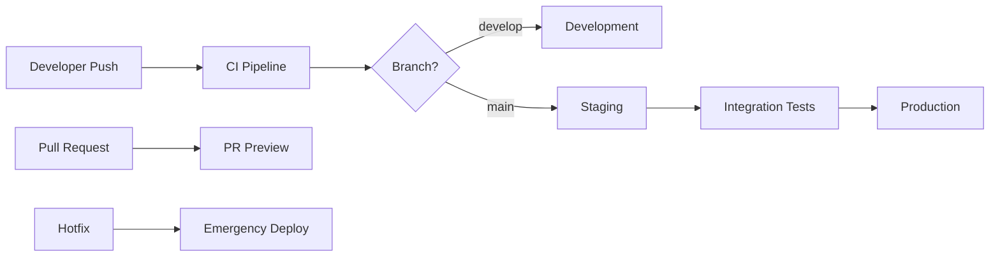

# CI/CD Pipeline Documentation

This document provides comprehensive information about the TailspinToys CI/CD pipeline setup using GitHub Actions.

## 📋 Overview

The CI/CD pipeline is designed with modern DevOps practices including:
- **Reusable Workflows** for consistency across environments
- **Azure OIDC Authentication** for secure deployments
- **Multi-environment support** (development, staging, production)
- **PR preview deployments** for testing changes
- **Hotfix deployment workflows** for urgent fixes
- **Comprehensive testing and security scanning**

## 🏗️ Architecture

### Workflow Structure

```
.github/workflows/
├── ci.yml                          # Main CI/CD pipeline
├── reusable-build-and-test.yml    # Reusable build/test workflow
├── reusable-azure-deploy.yml      # Reusable deployment workflow
├── pr-preview.yml                 # PR preview deployments
└── hotfix-deploy.yml              # Emergency hotfix deployments
```

### Environment Flow



## 🔧 Setup Instructions

### 1. Azure Resource Setup

#### Create Azure Resources
```bash
# Resource Group
az group create --name "tailspintoys-rg" --location "East US"

# App Service Plans
az appservice plan create \
  --name "tailspintoys-plan" \
  --resource-group "tailspintoys-rg" \
  --sku "B1" \
  --is-linux

# App Services
az webapp create \
  --name "tailspintoys-dev" \
  --resource-group "tailspintoys-rg" \
  --plan "tailspintoys-plan" \
  --runtime "DOTNETCORE:8.0"

az webapp create \
  --name "tailspintoys-staging" \
  --resource-group "tailspintoys-rg" \
  --plan "tailspintoys-plan" \
  --runtime "DOTNETCORE:8.0"

az webapp create \
  --name "tailspintoys-prod" \
  --resource-group "tailspintoys-rg" \
  --plan "tailspintoys-plan" \
  --runtime "DOTNETCORE:8.0"
```

#### Create Service Principal for OIDC
```bash
# Create the service principal
az ad sp create-for-rbac \
  --name "tailspintoys-github-actions" \
  --role "Contributor" \
  --scopes "/subscriptions/{subscription-id}/resourceGroups/tailspintoys-rg" \
  --sdk-auth

# Enable OIDC
az ad app federated-credential create \
  --id {client-id} \
  --parameters '{
    "name": "tailspintoys-github-main",
    "issuer": "https://token.actions.githubusercontent.com",
    "subject": "repo:YOUR_USERNAME/YOUR_REPO:ref:refs/heads/main",
    "description": "GitHub Actions - Main Branch",
    "audiences": ["api://AzureADTokenExchange"]
  }'

az ad app federated-credential create \
  --id {client-id} \
  --parameters '{
    "name": "tailspintoys-github-develop",
    "issuer": "https://token.actions.githubusercontent.com",
    "subject": "repo:YOUR_USERNAME/YOUR_REPO:ref:refs/heads/develop",
    "description": "GitHub Actions - Develop Branch",
    "audiences": ["api://AzureADTokenExchange"]
  }'
```

### 2. GitHub Repository Setup

#### Required Secrets
Navigate to `Settings > Secrets and Variables > Actions` and add:

| Secret Name | Description | Example Value |
|-------------|-------------|---------------|
| `AZURE_CLIENT_ID` | Azure service principal client ID | `12345678-1234-1234-1234-123456789012` |
| `AZURE_TENANT_ID` | Azure tenant ID | `87654321-4321-4321-4321-210987654321` |
| `AZURE_SUBSCRIPTION_ID` | Azure subscription ID | `11111111-2222-3333-4444-555555555555` |
| `CODECOV_TOKEN` | Codecov token (optional) | `a1b2c3d4-e5f6-7890-1234-567890abcdef` |
| `SONAR_TOKEN` | SonarCloud token (optional) | `sonar_token_here` |
| `DEV_APP_SETTINGS_JSON` | Development app settings | `{"Setting1":"Value1"}` |
| `STAGING_APP_SETTINGS_JSON` | Staging app settings | `{"Setting1":"Value2"}` |
| `PROD_APP_SETTINGS_JSON` | Production app settings | `{"Setting1":"ProdValue"}` |
| `TEAMS_WEBHOOK_URL` | Microsoft Teams webhook (optional) | `https://outlook.office.com/webhook/...` |
| `SLACK_WEBHOOK_URL` | Slack webhook (optional) | `https://hooks.slack.com/services/...` |

#### Required Variables
Navigate to `Settings > Secrets and Variables > Actions > Variables` and add:

| Variable Name | Description | Example Value |
|---------------|-------------|---------------|
| `AZURE_WEBAPP_NAME_DEV` | Development app service name | `tailspintoys-dev` |
| `AZURE_WEBAPP_NAME_STAGING` | Staging app service name | `tailspintoys-staging` |
| `AZURE_WEBAPP_NAME_PROD` | Production app service name | `tailspintoys-prod` |

#### Environment Setup
Create the following environments in `Settings > Environments`:

1. **development** (no protection rules)
2. **staging** (optional: require reviewers)
3. **production** (require reviewers, deployment branches: main only)

### 3. Application Configuration

#### Health Check Endpoint
Add a health check endpoint to your application:

```csharp
// Program.cs
app.MapGet("/health", () => Results.Ok(new { 
    Status = "Healthy", 
    Timestamp = DateTime.UtcNow,
    Version = typeof(Program).Assembly.GetName().Version?.ToString()
}));
```

#### Application Settings Structure
```json
{
  "Logging": {
    "LogLevel": {
      "Default": "Information",
      "Microsoft.AspNetCore": "Warning"
    }
  },
  "ConnectionStrings": {
    "DefaultConnection": "your-connection-string"
  },
  "ApplicationSettings": {
    "Environment": "Production",
    "FeatureFlags": {
      "EnableNewFeature": false
    }
  }
}
```

## 🔄 Workflow Details

### Main CI/CD Pipeline (`ci.yml`)

**Triggers:**
- Push to `main`, `develop`, `demo/*` branches
- Pull requests to `main`, `develop`
- Manual workflow dispatch

**Jobs:**
1. **Build & Test** - Builds solution and runs tests
2. **Code Quality** - SonarCloud analysis and security scans (PR only)
3. **Deploy Development** - Auto-deploy to dev environment
4. **Deploy Staging** - Deploy to staging with integration tests
5. **Deploy Production** - Manual approval required
6. **Production Smoke Tests** - Verify production deployment
7. **Notify Team** - Send notifications to Teams/Slack

### PR Preview Workflow (`pr-preview.yml`)

**Triggers:**
- Pull request opened/updated
- Manual cleanup

**Features:**
- Creates temporary deployment slots for PR testing
- Updates PR comments with preview URLs
- Automatic cleanup when PR is closed/merged

### Hotfix Deployment (`hotfix-deploy.yml`)

**Triggers:**
- Manual workflow dispatch only

**Features:**
- Emergency production deployment capability
- Branch validation (must be hotfix/* or main)
- Optional staging bypass for critical fixes
- Manual approval gates for production
- Automated issue tracking and notifications

### Reusable Workflows

#### Build and Test (`reusable-build-and-test.yml`)
- Configurable .NET version, configuration, solution path
- Code coverage collection and upload
- Security vulnerability scanning
- Static code analysis
- Test result publishing

#### Azure Deploy (`reusable-azure-deploy.yml`)
- OIDC authentication to Azure
- Configurable deployment settings
- Health checks after deployment
- Deployment slot support
- App settings configuration

## 🚀 Deployment Process

### Automatic Deployments

| Branch | Environment | Trigger | Approval Required |
|--------|-------------|---------|-------------------|
| `develop` | Development | Push | No |
| `main` | Staging → Production | Push | Yes (Production) |
| PR branches | PR Preview | PR opened | No |
| `hotfix/*` | Staging/Production | Manual | Yes (Production) |

### Manual Deployments

#### Standard Deployment
1. Go to `Actions > CI/CD Pipeline`
2. Click `Run workflow`
3. Select environment and options
4. Click `Run workflow`

#### Hotfix Deployment
1. Go to `Actions > Hotfix Deployment`
2. Click `Run workflow`
3. Fill in hotfix description and target environment
4. For production: approval will be required
5. Click `Run workflow`

### Deployment Verification

After each deployment, the following checks are performed:
- Application health check
- Response time verification
- Basic functionality tests
- Integration tests (staging only)

## 🔍 Monitoring and Troubleshooting

### Monitoring Deployment Status

#### GitHub Actions Dashboard
- Navigate to repository `Actions` tab
- View workflow runs and status
- Check logs for detailed information

#### Azure Portal Monitoring
- Navigate to App Service in Azure Portal
- Check `Deployment Center` for deployment history
- Monitor application logs and metrics

### Common Issues and Solutions

#### Deployment Failures

**Issue: Azure login fails**
```
Solution: Verify OIDC configuration and federated credentials
- Check AZURE_CLIENT_ID, AZURE_TENANT_ID, AZURE_SUBSCRIPTION_ID
- Ensure federated credentials are configured for the repository
```

**Issue: Build fails with missing dependencies**
```
Solution: Clear package cache or update dependencies
- Check .csproj files for correct package versions
- Verify global.json for SDK version requirements
```

**Issue: Health check fails after deployment**
```
Solution: Check application startup and configuration
- Verify app settings are correctly configured
- Check application logs in Azure Portal
- Ensure health check endpoint is implemented
```

#### Performance Issues

**Slow deployments**
- Enable package caching (already implemented)
- Consider using self-hosted runners for better performance
- Optimize Docker images if using containerized deployments

**High resource usage**
- Monitor Azure App Service metrics
- Scale up App Service Plan if needed
- Optimize application code and database queries

### Logging and Diagnostics

#### GitHub Actions Logs
- All workflow runs include detailed logs
- Failed jobs highlight specific error messages
- Logs are retained based on organization settings

#### Application Logs
```bash
# View live logs
az webapp log tail --name tailspintoys-prod --resource-group tailspintoys-rg

# Download logs
az webapp log download --name tailspintoys-prod --resource-group tailspintoys-rg
```

## 🔐 Security Considerations

### Authentication and Authorization
- OIDC authentication eliminates long-lived secrets
- Service principal has minimal required permissions
- Environment-based access controls

### Secrets Management
- All sensitive data stored as GitHub secrets
- Environment-specific secrets for each deployment target
- Regular rotation of authentication credentials

### Security Scanning
- Automated vulnerability scanning of dependencies
- Static code analysis with SonarCloud (if configured)
- Security-focused build configurations

### Network Security
- HTTPS enforcement on all environments
- Azure App Service built-in security features
- Application-level security headers

## 📊 Metrics and Reporting

### Deployment Metrics
- Deployment frequency and success rate
- Lead time for changes
- Mean time to recovery (MTTR)
- Change failure rate

### Quality Metrics
- Code coverage percentage
- Test pass/fail rates
- Security vulnerability counts
- Performance benchmarks

### Monitoring Integration
- Application Insights for performance monitoring
- Azure Monitor for infrastructure metrics
- Custom health check endpoints
- Notification integration for Teams/Slack

## 🔄 Maintenance and Updates

### Regular Maintenance Tasks

#### Monthly
- Review and update GitHub Actions versions
- Check for Azure CLI updates
- Review security scan results
- Update documentation as needed

#### Quarterly
- Review and rotate authentication credentials
- Evaluate deployment performance metrics
- Update .NET SDK versions
- Review and optimize workflows

#### Annually
- Security audit of CI/CD pipeline
- Review and update Azure resource configurations
- Evaluate new GitHub Actions features
- Update deployment strategies

### Upgrading the Pipeline

#### Adding New Environments
1. Create Azure resources
2. Add environment variables and secrets
3. Update workflow configurations
4. Test deployment process

#### Modifying Workflows
1. Create feature branch for workflow changes
2. Test changes thoroughly
3. Update documentation
4. Deploy via pull request process

## 📝 Best Practices

### Workflow Development
- Use reusable workflows for consistency
- Implement proper error handling
- Add meaningful comments and documentation
- Test workflow changes thoroughly

### Deployment Strategy
- Always test in lower environments first
- Implement proper approval gates
- Use deployment slots for zero-downtime deployments
- Monitor applications after deployment

### Security
- Rotate secrets regularly
- Use least privilege access
- Enable audit logging
- Regular security reviews

### Performance
- Use caching where appropriate
- Optimize workflow execution time
- Monitor resource usage
- Scale infrastructure as needed

## 🆘 Support and Contacts

### Internal Support
- **DevOps Team**: devops@company.com
- **Development Team**: dev@company.com
- **Operations Team**: ops@company.com

### External Resources
- [GitHub Actions Documentation](https://docs.github.com/en/actions)
- [Azure App Service Documentation](https://docs.microsoft.com/en-us/azure/app-service/)
- [.NET Deployment Guide](https://docs.microsoft.com/en-us/dotnet/core/deploying/)

### Emergency Contacts
- **On-call Engineer**: +1-555-0123
- **DevOps Lead**: +1-555-0456
- **System Administrator**: +1-555-0789

---

*This documentation is maintained by the DevOps team and updated with each major pipeline change.*